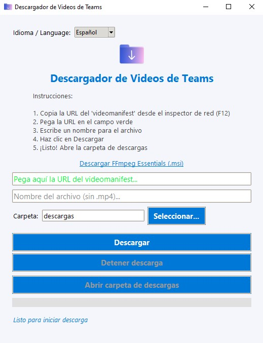

# 🚀 Teams Video Downloader v1.2



**Autor:** RoanDev  
**Versión:** 1.2  
**Licencia:** MIT  
**Repositorio:** https://github.com/RoanDev/teams-video-downloader

---

## 🖥️ Descripción

Aplicación moderna para Windows que permite descargar videos de Microsoft Teams, SharePoint y OneDrive a partir de la URL del `videomanifest` usando `ffmpeg`.  
Incluye interfaz gráfica intuitiva, barra de progreso, selección de carpeta de destino, internacionalización (español/inglés), y más.

---

## 🆕 Novedades v1.2

- 🔇 Las ventanas CMD ya no aparecen durante la descarga (proceso silencioso)
- 📂 Corregido: la selección de carpeta de destino ahora funciona correctamente
- 🖼️ Logo de la aplicación visible en la interfaz
- 🎨 Interfaz mejorada con instrucciones más claras
- 📏 Ventana redimensionada para mejor visualización

---

## 🛠️ Tecnologías utilizadas

- 🐍 **Python 3.10+**
- 🖼️ **Tkinter** (Interfaz gráfica)
- 🖼️ **Pillow** (Procesamiento de imágenes)
- ⚙️ **ffmpeg** y **ffprobe** (procesamiento de video)
- 📋 **pyperclip** (portapapeles, opcional)
- 📦 **PyInstaller** (empaquetado a .exe)
- 🗃️ **Git** (control de versiones)

---

## ✨ Características principales

- 🎨 Interfaz gráfica moderna y responsiva
- 🌐 Soporte multilenguaje: Español 🇪🇸 / Inglés 🇬🇧
- 📋 Pegado automático de la URL desde el portapapeles
- 📂 Selección de carpeta de destino para las descargas
- 🟩 Barra de progreso verde neón y mensajes claros
- 🛑 Botón para detener la descarga en cualquier momento
- 📁 Botón para abrir la carpeta de descargas al finalizar
- 📝 Registro de errores en `app.log`
- 🏷️ Nombre de archivo: `nombre_usuario_fecha.mp4`
- 🛡️ Manejo robusto de errores y validación de URL

---

## 🏗️ Instalación y uso

1. **Clona este repositorio**  
   `git clone https://github.com/RoanDev/teams-video-downloader.git`

2. **Crea y activa un entorno virtual**  
   `python -m venv venv`  
   `venv\Scripts\activate`

3. **Instala las dependencias**  
   `pip install -r requirements.txt`  
   (Si no existe, instala manualmente: `pip install pyperclip`)

4. **Instala ffmpeg y ffprobe**  
   - Recomendado: [Instalador automático](https://github.com/icedterminal/ffmpeg-installer/releases/latest)  
   - O manual: [Gyan.dev](https://www.gyan.dev/ffmpeg/builds/) o [BtbN/FFmpeg-Builds](https://github.com/BtbN/FFmpeg-Builds/releases/tag/latest)

5. **Ejecuta la aplicación**  
   `python main.py`

6. **(Opcional) Genera el ejecutable**  
   `python build_exe.py`  
   O directamente:  
   `pyinstaller --onefile --windowed --icon=ico/favicon.ico --name TeamsDownloader-v1.2 main.py`

---

## 📝 Instrucciones de uso

1. Abre el video en Teams/SharePoint/OneDrive y copia la URL del `videomanifest` desde el inspector de red.
2. La aplicación pegará automáticamente la URL si está en el portapapeles.
3. Ingresa el nombre del archivo (sin `.mp4`), selecciona la carpeta de destino y haz clic en **Descargar**.
4. Puedes detener la descarga en cualquier momento.
5. Al finalizar, abre la carpeta de descargas con un solo clic.

---

## 📂 Estructura del proyecto

```
app/
├── __init__.py
├── downloader.py
├── ui.py
├── utils.py
ico/
├── favicon.ico
.github/
├── copilot-instructions.md
main.py
build_exe.py
version.txt
README.md
TODO.md
.gitignore
descargas/
```

---

## 🧑‍💻 Créditos
Desarrollado por **RoanDev**
¡Gracias por usar y compartir esta herramienta! ⭐

---

## ⚠️ Descargo de responsabilidad

Esta herramienta es solo para fines educativos y personales.
El uso para descargar contenido protegido sin permiso puede violar los términos de servicio de Microsoft y derechos de autor.
El autor no se responsabiliza por el uso indebido del software ni por posibles consecuencias legales.